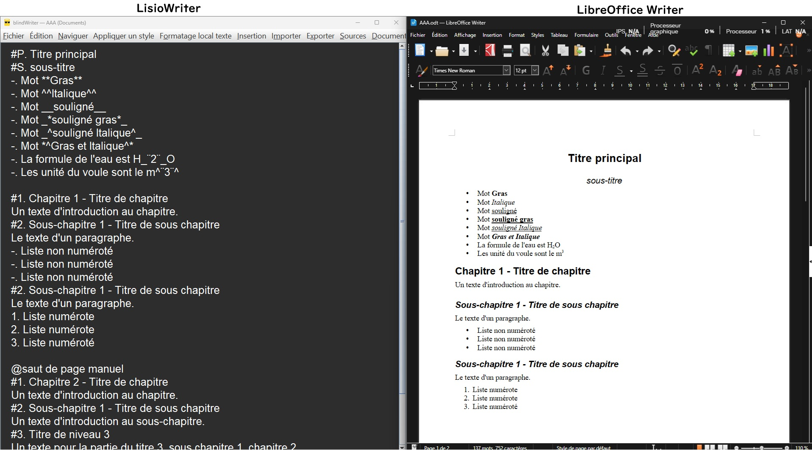

# LisioWriter

**LisioWriter** est un **logiciel de traitement de texte** conçu spécialement pour les personnes **non-voyantes ou malvoyantes**.
Son interface est pensée pour être utilisée **entièrement au clavier** et reste compatible avec les lecteurs d’écran tels que **NVDA** ou **JAWS**.

La mise en forme du texte (titres, listes, emphase, etc.) n’est pas appliquée de manière invisible, mais indiquée directement par de petits codes lisibles inspirés du **Markdown**.

**Ces codes sont intégrés directement dans le texte**. Ils sont ensuite lus par le lecteur d’écran et transmis à la barre braille, ce qui permet à l’utilisateur de savoir exactement quelle mise en forme est appliquée.

Ce logiciel s’adresse particulièrement aux étudiants de niveau post-bac, engagés dans des études supérieures, ainsi qu’à toute personne souhaitant rédiger des documents structurés de manière autonome malgré un handicap visuel.
LisioWriter facilite la production de rapports, mémoires, travaux universitaires et documents professionnels accessibles et correctement formatés.

---

## 📌 Exemple de code dans LisioWriter

- **#P. Mon titre du document** : Indique mon titre pincipale de niveau hiérarchique corps de texte.
- **#S. Un sous-titre** : Indique un sous-titre  de niveau hiérarchique corps de texte.
- **#1. Un titre** : Indique un titre de chapitre de niveau hiérachique 1 (équivalent à **Titre 1** sous Writer , Word, ou bien la balise **\<H1\>Titre<\H1\>** dans une page web).
- **#2. Un titre** : Indique un titre de niveau hiérarchique 2.
- **etc.**

- **\*\*mot en gras\*\*** : Indique des mots en gras.
- **\*^mot en italique^\*** : Indique des mots en italique.
- **\_\_mots soulignés\_\_** : Indique des mots soulignés.
- **\_\*mots gras soulignés\*\_** : Indique des mots gras soulignés.
- **etc.**

- **@saut de page** : Indique un saut de page.
- **@(note de bas de page)** : Indique une note de bas de page.
- °°**Faute** : Indique une erreur orthographique ou grammaticale.
- **etc.**

---

## 🎯 Objectifs

Permettre à toute personne **non-voyante** ou **déficiente visuelle** de rédiger, lire et mettre en forme des documents de manière fluide, rapide et indépendante, grâce à une interface accessible et simple d’utilisation.

Le logiciel s’adresse en priorité :

- aux **étudiants** non-voyants ou malvoyants engagés dans des **cursus post-bac**,
- ainsi qu’aux **adultes** déjà expérimentés dans l’usage des **traitements de texte**.

L’objectif est de fournir un outil qui favorise l’autonomie numérique, tout en restant proche des standards bureautiques connus (Word, Writer, Markdown), afin de faciliter l’apprentissage et **l’intégration dans les environnements éducatifs ou professionnels**.

---

## ✨ Fonctionnalités principales

- **Interface 100 % clavier** : navigation par raccourcis, annonces contextuelles.  
- **Compatibilité NVDA / JAWS** : lecture vocale automatique des actions et des éléments de texte.  
- **Ouverture et exportation** :
  - Fichiers **.docx** (Microsoft Word)
  - Fichiers **.odt** (LibreOffice Writer)
  - Fichiers **.txt** (texte brut)
  - Fichiers  **.html** (page web)
  - Exportation en **PDF**
- **Vérification orthographique intégrée** (basée sur *LanguageTool*).  
- **Surlignage et tag preffix °° des erreurs et suggestion des corrections**.  
- **Mode documentation LisioWriter** : **ALT+A** permet de basculer sur la documentation et **ALT+B** permet de basculer sur son fichier.
- **Navigateur et navigation** : Fenêtre simple pour la navigation par les titres.
- **Marque page** : intégration de marque page et de note.
- **Système de mise à jour automatique** : télécharge et installe la dernière version en arrière-plan (mode silencieux).  
- 🪶 **Recherche et insertion d’articles Wikipédia** : trouvez, sélectionnez et insérez un article complet dans l’éditeur, déjà mis en forme et structuré.

---

## 🪶 Nouvelle fonctionnalité : intégration Wikipédia

LisioWriter permet désormais de rechercher et d’importer directement des articles Wikipédia depuis l’éditeur.
L’utilisateur saisit un mot-clé, parcourt les résultats, puis insère l’article choisi dans son document.

Le contenu est automatiquement converti avec la structure et la mise en forme du texte d’origine :
titres hiérarchisés, paragraphes, listes, liens et emphases sont traduits au format lisible et compatibles avec les lecteurs d’écran et barres braille.

---

## 🧩 Installation
⚠️ **Actuellement, LisioWriter est uniquement disponible pour Windows.**  
Une version multiplateforme (Linux, macOS) pourra être envisagée plus tard.

1. Téléchargez la dernière version depuis la page [**Releases**](https://github.com/1-pablo-rodriguez/LisioWriter/releases).  
2. Exécutez le fichier `Installation_LisioWriter_x.x.x.exe`.  
3. Suivez les instructions vocales.  
4. Un raccourci sera créé sur le bureau et dans le menu Démarrer.

---

## 🎹 Raccourcis clavier pratiques

Le tableau ci-dessous illustre quelques fonctions pratiques de LisioWriter accessibles au clavier :

| Raccourci       | Fonction                    | Description                                                                 |
|-----------------|-----------------------------|-----------------------------------------------------------------------------|
| **F1**          | Informations                | Annonce des informations sur la fenêtre en cours ou sur l’ensemble du document. |
| **F2**          | Lecture de titre            | Dans une fenêtre, annonce le titre du paragraphe et le titre suivant.      |
| **Ctrl+F2**     | Insérer/Supprimer un marque-page | Insère ou supprime un marque-page associé à une note.                  |
| **F3 / Maj+F3** | Navigation par titres       | Passe rapidement au titre suivant ou au titre précédent.                   |
| **F4 / Maj+F4** | Navigation par marque-page  | Passe rapidement au marque-page suivant ou au marque-page précédent.       |
| **Alt+A**       | Documentation intégrée      | Ouvre la documentation interne de LisioWriter.                             |
| **F6**          | Navigateur de titres        | Ouvre le navigateur pour parcourir la structure du document.               |
| **F7 / Maj+F7** | Erreur suivante / précédente | Sélectionne le mot ou le texte suivant ou précédent contenant une faute ou une erreur. |
| **Ctrl+F7**     | Vérification du document    | Lance la vérification orthographique et grammaticale de tout le document.  |
| **F8**          | Article Wikipédia           | Insère dans l’éditeur des articles Wikipédia structurés avec leur mise en forme et leur hiérarchie. |

Toutes les fonctions du logiciel sont accessibles **entièrement au clavier, sans souris**.  
Les menus sont conçus pour être **vocalisés** et **compatibles avec les barres braille**, afin de garantir une accessibilité complète.

---

## 🧱 Technologies utilisées

- **Java 19** (Swing)  
- **LanguageTool** pour la correction grammaticale et orthographique  
- **Apache POI** pour la lecture/écriture de fichiers Word  
- **ODFDOM** pour le format LibreOffice  
- **iText** pour l’exportation PDF  
- **Inno Setup** pour le programme d’installation et la mise à jour  
- **SAPI** (Microsoft Speech API) pour la synthèse vocale pendant l’installation
- -**MAVEN** 
- **etc.**

---

## 🔄 Mise à jour automatique

Après la première installation, il est possible à l'utilisateur non-voyante de réaliser des mise à jour automatique.
Dans le menu **Préférence**, les mises à jour se font via un fichier `updates.json` hébergé sur GitHub :  
> `https://raw.githubusercontent.com/1-pablo-rodriguez/LisioWriter/main/updates.json`

**Les nouvelles versions sont téléchargées et installées automatiquement en mode silencieux** (aucune fenêtre s'affiche).

---

## 💬 Contribution

Les contributions sont les bienvenues !  
Vous pouvez :
- Signaler des bugs dans l’onglet **Issues**.
- Proposer des améliorations d’accessibilité ou de compatibilité.
- Soumettre des pull requests.

---

## 👤 Auteur

**LisioWriter** a été développé par **Pablo Rodriguez** dans le cadre d’une démarche de recherche et d’innovation pédagogique visant à promouvoir **l’autonomie numérique des personnes non-voyantes ou malvoyantes**.  

Le logiciel a été expérimenté et validé auprès d’un étudiant en licence puis en master à **l’Université d’Artois**.  
Cette phase de test a permis de mesurer l’accessibilité et l’ergonomie du logiciel, ainsi que sa capacité à répondre aux besoins effectifs des utilisateurs, tant dans le cadre **académique** que dans le milieu **professionnel** (stage de 2x4 mois sur les deux années de Master).

Ces validations confirment la pertinence de LisioWriter comme outil d’*inclusion numérique**, adapté tant à l’enseignement supérieur qu’à un **usage professionnel**.

---

## 🪪 Licence

Ce logiciel est distribué sous licence **GNU GLP3.0**.  
Vous pouvez l’utiliser, le modifier et le redistribuer librement à condition de conserver la mention du copyright.

---

📚 **Mots-clés :**
accessibilité, non-voyant, malvoyant, NVDA, JAWS, traitement de texte, braille, Java, Markdown, éducation inclusive, autonomie numérique

---

> 💡 *LisioWriter est avant tout un outil d’inclusion numérique, conçu pour que la rédaction, la lecture et la révision de documents soient accessibles à tous.*

