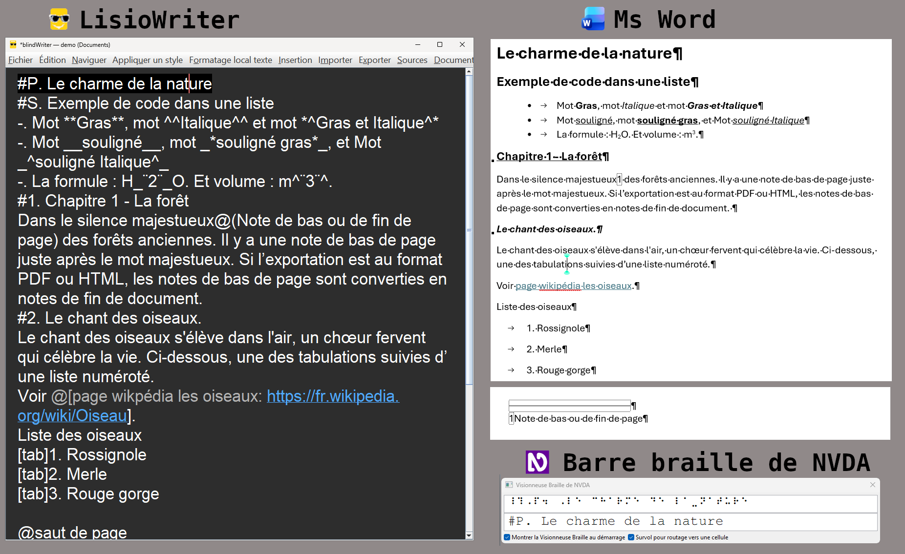
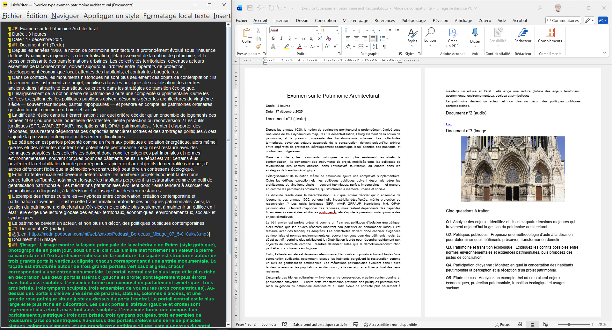

#  LisioWriter


# LisioWriter — l’éditeur qui rend la mise en forme visible et lisible pour tous

**LisioWriter** est bien plus qu’un **traitement de texte** pour les personnes **non-voyantes** ou **malvoyantes** : il intègre, au sein même de l’éditeur, un navigateur qui rend tous les articles de Wikipédia en français accessibles, rapidement et très simplement.
Tout se pilote au clavier, fonctionne avec NVDA ou JAWS, et la mise en forme est exprimée par de petits codes lisibles inspirés du Markdown (ex. #P. , #1. , ^^italique^^, @t, ...), directement dans le texte.

## Pourquoi c’est précieux pour les aidants ?

- Moins d’ambiguïtés : la mise en forme n’est pas “cachée” dans un ruban — elle est visible et verbalisable (lecteur d’écran & braille).

- Accompagnement facilité : vous pouvez relire, corriger, guider à distance sans ouvrir un traitement de texte lourd dans lequels l'accessibilité et pensée pour la souris.

- Transferts fluides : import/export Word, Writer/ODT, HTML, texte brut → pas d’impasse technique dans les échanges avec l’école, l’université ou l’entreprise.

- Montée en autonomie : l’élève/l’étudiant sait où est un titre, une liste, une note, le début d'un paragraphe… et apprend plus vite les bonnes pratiques.

- Mises à jour silencieuses : après la première installation, les suivantes se font sans fenêtre ni action. Fermez LisioWriter, patientez ~2 minutes, puis relancez-le pour bénéficier de la nouvelle version.

## Comment ça marche ?

- Les titres, listes, emphases, indices/exposants, tabulations, notes de bas de page, images (avec description & légende), liens et tableaux sont importés depuis Word/Writer et convertis en codes LisioWriter visibles dans l’éditeur.

- La colorisation rend ces codes confortables aussi pour les malvoyants ou les aidants qui utilisent la souris et l'écran.

- À tout moment, on peut exporter vers Word/ODT/HTML/texte pour partager un document accessible et proprement structuré.

## À qui s’adresse LisioWriter ?

- Étudiants post-bac et professionnels souhaitant produire des documents accessibles et bien structurés au clavier.

- Aidants (enseignants, tuteurs, AESH, services handicap) qui ont besoin d’un outil fiable, léger et interopérable pour accompagner, relire et corriger.


## 🎯 Pourquoi ? 

- L’ambition de LisioWriter est de favoriser l’**autonomie numérique** et l’**inclusion**, tout en restant proche des **standards bureautiques** connus (Word, Writer, Markdown) afin de faciliter l’apprentissage et l’intégration dans les **environnements éducatifs et professionnels**.

---

# 📚 👉 [Guide pour les enseignants & les aidants](https://1-pablo-rodriguez.github.io/LisioWriter/)

Avec l’expérience de l’enseignement, un point revient régulièrement :  
les notions de **mise en forme** et de **structuration du texte** — titres hiérarchisés, styles de paragraphe, listes, citations, etc. — sont **peu ou pas enseignées** aux apprenants non-voyants.  

Conséquence : la prise en main d’un traitement de texte devient plus complexe qu’elle ne devrait l’être, alors qu’une bonne structuration facilite autant l’accessibilité que l’efficacité.

À cela s’ajoute une difficulté souvent sous-estimée : **rédiger des énoncés réellement accessibles**.  
Pour de nombreux enseignants, produire des consignes adaptées aux non-voyants représente un défi :  
- il faut veiller à une formulation claire et non ambiguë ;  
- structurer chaque étape de la consigne pour qu’elle soit navigable à la synthèse vocale ;  
- fournir des descriptions précises pour les images, schémas ou tableaux ;  
- éviter les informations uniquement visuelles (couleurs, formes, mise en page) ;  
- penser à la navigation au clavier et à la logique de lecture linéaire.  

Tout cela demande du temps, une méthodologie et parfois un accompagnement, alors que ce sont des compétences rarement expliquées dans la formation initiale.


 

---

## Capture d’écran — Import d’un fichier Word

Après import, la structure est explicitée : titres, listes, styles (gras, italique, souligné), indices/exposants, tabulations, notes, images (description + légende), liens et tableaux deviennent des codes LisioWriter.
Résultat : tout est lisible en braille et navigable au clavier (par ex. le titre principal apparaît avec #P.). 

Ci-dessous, tu peux voir d’un côté la capture d’écran d’un sujet d’examen créé par l’enseignant, et de l’autre exactement le même fichier ouvert dans LisioWriter.

1. **Le lien vers le fichier audio** devient directement cliquable dans LisioWriter : il suffit d’appuyer sur **Ctrl + Espace** pour l’ouvrir instantanément.

2. **L’image est accessible** grâce au texte de remplacement, dans lequel l’enseignant a décrit en détail son contenu.

3. **Les questions sont structurées en titres de niveau**, ce qui permet d’y accéder rapidement avec les touches **F3**, **F4**, etc., pour naviguer d’un titre à l’autre très facilement.




---

### 👨‍🏫 conception et cadre de recherche

Le projet LisioWriter a été conçu et développé par Pablo Rodriguez, enseignant en informatique à l’**Université d’Artois**, dans le cadre d’une démarche personnelle de **recherche et d’innovation pédagogique** visant à promouvoir l’**autonomie numérique** des personnes **non-voyantes** ou **malvoyantes**.

Le logiciel a été **expérimenté et validé** auprès d’un **étudiant non-voyant** ayant suivi un parcours complet de **Licence** et actuellement inscrit en **Master Gestion du Patrimoine Culturel** à l’Université d’Artois, au sein de l’**UFR d’Histoire et de Géographie**.  

Durant la **Licence d’Histoire**, cette expérimentation a permis d’observer et d’évaluer durant les travaux dirigés :
- l’**accessibilité réelle** de l’interface,  
- l’**ergonomie fonctionnelle** de l’éditeur,  
- et la capacité du logiciel à répondre aux besoins concrets de l’utilisateur, tant dans un **contexte académique** que lors de **situations professionnelles** (rédaction rapport de stage).

Actuellement en **Master Gestion du Patrimoine Culturel**, l’utilisateur est confronté à de nouveaux défis techniques et à des exigences accrues :
- un stage de 2×4 mois répartis sur les deux années du cursus,  
- des besoins académiques plus complexes,  
- et une collaboration renforcée avec les collègues et encadrants, favorisant une utilisation plus collective et critique de LisioWriter.

Ces innovations, menées au sein de la **Licence d’Histoire** de l’Université d’Artois, tendent à confirmer la **pertinence de LisioWriter** en tant qu’outil d’**inclusion numérique**, adapté à l’enseignement supérieur et à un **usage professionnel autonome et accessible**.  

Cependant, l’expérimentation menée auprès d’un **seul étudiant non-voyant** ne permet pas encore d’évaluer la **portée générale** et la **diversité d’usage** du logiciel. Une phase d’expérimentation plus large, incluant plusieurs profils d’utilisateurs non-voyants, sera nécessaire pour **valider** les résultats observés et affiner les **fonctions d’accessibilité et d’ergonomie** de l’éditeur.

---

## ✨ Fonctionnalités principales

- **Interface 100 % clavier** : navigation par raccourcis, annonces contextuelles.  
- **Compatibilité NVDA / JAWS** : lecture vocale automatique des actions et des éléments de texte.  
- **Ouverture et exportation** :
  - Fichiers **.docx** (Microsoft Word)
  - Fichiers **.odt** (LibreOffice Writer)
  - Fichiers **.txt** (texte brut)
  - Fichiers  **.html** (page web)
  - Exportation en **PDF**
- **Vérification orthographique intégrée** (basée sur *LanguageTool*).  
- **Marquage des erreurs : preffix °° et surlignage des erreurs avec suggestion des corrections**.  
- **Mode documentation LisioWriter** : **ALT+A** permet de basculer sur la documentation et **ALT+B** permet de basculer sur son fichier.
- **Navigateur et navigation** : Fenêtre simple pour la navigation par les titres, raccourci clavier pour atteindre le titre suivant ou précédent..
- **Marque-page** : intégration très simple de marque page et de note.
- **Système de mise à jour automatique** : télécharge et installe la dernière version en arrière-plan (mode silencieux).  
- 🪶 **Recherche et insertion d’articles Wikipédia** : recherche, sélectionne et insère un article complet dans l’éditeur, déjà mis en forme et structuré.

---

##  Intégration de Wikipédia

LisioWriter permet désormais de **rechercher et d’importer directement des articles Wikipédia** sans quitter l’éditeur.  
L’utilisateur saisit un mot-clé, parcourt les résultats, puis insère l’article sélectionné dans son document.

Lors de l’importation, **seul le contenu principal de l’article est conservé** :  
les menus, tableaux, infobox et autres éléments non pertinents sont automatiquement exclus, garantissant une lecture fluide et accessible.

L’utilisateur peut ensuite, s’il le souhaite, **nettoyer le texte importé** en supprimant :

- les liens de l’article : `@[lien : URL]`  
- les images : `![Image : description]`

Le contenu est automatiquement **converti au format LisioWriter**, qui préserve la **structure logique** et la **mise en forme du texte d’origine** :  
titres hiérarchisés, paragraphes, listes, liens et emphases sont reproduits dans un format **lisible, accessible et compatible avec les lecteurs d’écran** ainsi qu’avec les **barres braille**.

👉 L’**utilisation du navigateur intégré** devient alors un outil très pratique.


---

## 🧩 Installation
⚠️ **Actuellement, LisioWriter est uniquement disponible pour Windows.**  
Une version multiplateforme (Linux, macOS) pourra être envisagée plus tard.

1. Téléchargez la dernière version depuis la page [**Releases**](https://github.com/1-pablo-rodriguez/LisioWriter/releases).  
2. Exécutez le fichier `Installation_LisioWriter_x.x.x.exe`.  
3. Suivez les instructions vocales.  
4. Un raccourci sera créé sur le bureau et dans le menu Démarrer.

---

## 🎹 Raccourcis clavier pratiques

Le tableau ci-dessous illustre quelques fonctions pratiques de LisioWriter accessibles au clavier :

| Raccourci       | Fonction                    | Description                                                                 |
|-----------------|-----------------------------|-----------------------------------------------------------------------------|
| **F1**          | Informations                | Annonce des informations sur la fenêtre en cours ou sur l’ensemble du document. |
| **F2**          | Lecture de titre            | Dans une fenêtre, annonce le titre du paragraphe et le titre suivant.      |
| **Ctrl+F2**     | Insérer/Supprimer un marque-page | Insère ou supprime un marque-page associé à une note.                  |
| **F3 / Maj+F3** | Navigation par titres       | Passe rapidement au titre suivant ou au titre précédent.                   |
| **F4 / Maj+F4** | Navigation par marque-page  | Passe rapidement au marque-page suivant ou au marque-page précédent.       |
| **F5**          | Lecture de la note du marque-page | La note du marque page s'affiche dans une fenêtre accessible<br>à la lecture avec la barre de barille.   |
| **F6**          | Navigateur de titres        | Ouvre le navigateur pour parcourir la structure du document.               |
| **F7 / Maj+F7** | Erreur suivante / précédente | Sélectionne le mot ou le texte suivant ou précédent<br>contenant une faute ou une erreur. |
| **Ctrl+F7**     | Vérification du document    | Lance la vérification orthographique et grammaticale de tout le document.  |
| **F8**          | Article Wikipédia           | Insère dans l’éditeur des articles Wikipédia structurés<br>avec leur mise en forme et leur hiérarchie. |
| **Ctrl+F**      | Recherche                   | Outils de recherche intégrant des jokers<br> **?** remplace un caractère<br> **\*** remplace des caractères <br> **==** Case rigoureuse<br> **&&** paragraphe contenant<br> **\#\#** titre contenant<br> **%d** chiffre |
| **Alt+A**       | Documentation intégrée      | Ouvre la documentation interne de LisioWriter.                             |


Toutes les fonctions du logiciel sont accessibles **entièrement au clavier, sans souris**.  
Les menus sont conçus pour être **vocalisés** et **compatibles avec les barres braille**, afin de garantir une accessibilité complète.

---

## 📌 Quelques exemple de code LisioWriter

LisioWriter utilise une syntaxe lisible inspirée du Markdown.  
Chaque élément de mise en forme est représenté directement dans le texte pour être interprété par les lecteurs d’écran et les barres braille.

```text
#P. Mon titre du document       → Titre principal du document
#S. Un sous-titre               → Sous-titre hiérarchique
#1. Chapitre 1                  → Titre de niveau 1 (équiv. à <h1> ou Titre 1 sous Word)
#2. Section secondaire          → Titre de niveau 2

**mot en gras**                 → Texte en gras
*^mot en italique^*             → Texte en italique
__mots soulignés__              → Texte souligné
_*mots gras soulignés*_         → Texte gras et souligné
_¨indice¨_                       → Indice
^¨exposant¨^                     → Exposant

@saut de page                   → Saut de page manuel
@(note de bas de page)          → Note de bas de page
°°Faute                         → Indique une erreur orthographique

@[Texte du lien : https://exemple.com]      → Lien accessible
![Image: Moineau. Légende : Oiseau sur une branche] → Image + légende
@t                               → Début tableau
|! Colonne A | Colonne B         → En-têtes
| Valeur 1  | Valeur 2           → Ligne
@/t                              → Fin tableau
```

---

## 🧱 Technologies utilisées

- **Java 19** (Swing)  
- **LanguageTool** pour la correction grammaticale et orthographique  
- **Apache POI** pour la lecture/écriture de fichiers Word  
- **ODFDOM** pour le format LibreOffice  
- **iText** pour l’exportation PDF  
- **Inno Setup** pour le programme d’installation et la mise à jour  
- **SAPI** (Microsoft Speech API) pour la synthèse vocale pendant l’installation
- -**MAVEN** 
- **etc.**

---

## 🔄 Mise à jour automatique

Après la première installation, il est possible à l'utilisateur non-voyante de réaliser des mise à jour automatique.
Dans le menu **Préférence**, les mises à jour se font via un fichier `updates.json` hébergé sur GitHub :  
> `https://raw.githubusercontent.com/1-pablo-rodriguez/LisioWriter/main/updates.json`

**Les nouvelles versions sont téléchargées et installées automatiquement en mode silencieux** (aucune fenêtre s'affiche).

---

## 💬 Contribution

Les contributions sont les bienvenues !  
Vous pouvez :
- Signaler des bugs dans l’onglet **Issues**.
- Proposer des améliorations d’accessibilité ou de compatibilité.
- Soumettre des pull requests.

---

## 🪪 Licence

Ce logiciel est distribué sous licence **GNU GPL-3.0**.  
Vous pouvez l’utiliser, le modifier et le redistribuer librement à condition de conserver la mention du copyright.

---

📚 **Mots-clés :**
accessibilité, non-voyant, malvoyant, NVDA, JAWS, traitement de texte, braille, Java, Markdown, éducation inclusive, autonomie numérique

---

> 💡 *LisioWriter est avant tout un outil d’inclusion numérique, conçu pour que la rédaction, la lecture et la révision de documents soient accessibles à tous.*


